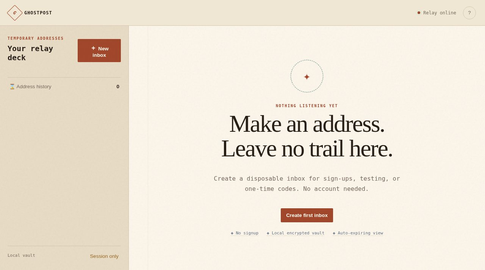

# Ghostpost

A private-by-design temporary inbox that runs directly from GitHub Pages.

**Live:** https://aeiouvcode.github.io/temp-mail/

## How it works

Ghostpost uses Guerrilla Mail's browser-accessible public API. Address creation, custom aliases, polling, message reading, copy, QR, local session history and burn-from-device all work without a backend or bundled key.

- Static, no signup, no analytics, no app backend
- Multiple simultaneous inbox sessions and custom aliases
- Automatic polling with a pause control
- Sandboxed HTML mail preview with remote images removed
- Credentials stay in session storage by default
- Optional AES-GCM encrypted local snapshot for the current session
- Plain-language errors instead of network dumps

## Privacy boundary

Messages pass through Guerrilla Mail and normally expire there after about one hour. Do not use disposable mail for banking, account recovery, health records, or sensitive personal data.
